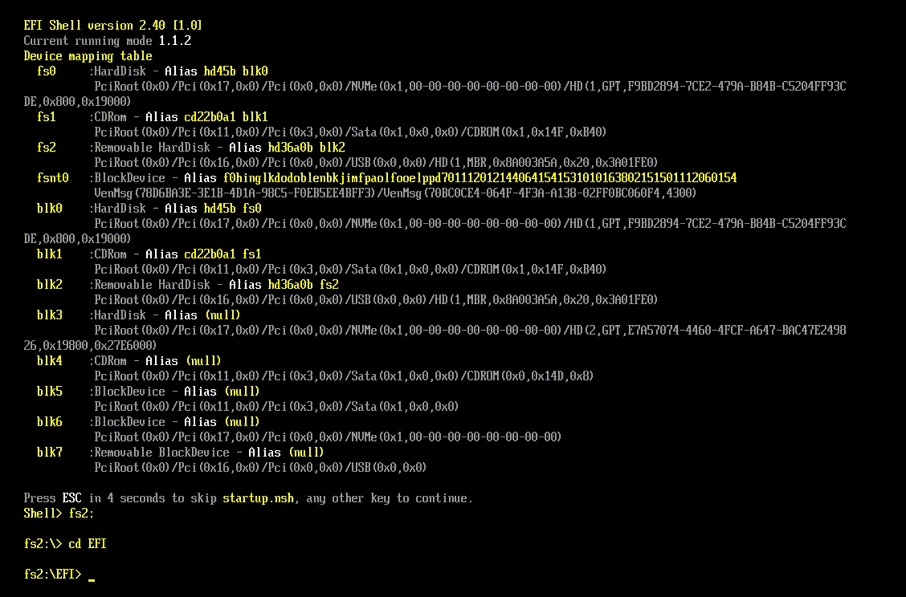

# Resilience
Another UEFI bootkit that drops payload in RT phase of OS.

## Usage
1. Move your payload to the file Payload.h
2. Create a bootable flash drive with `\EFI\Boot` structure. In the `Boot` folder you should put **ResilienceLoader**, renamed **bootx64.efi**. In the folder **EFI** must be the bootkit itself (not the bootloader). If needed, the path to the bootkit can be changed in ResilienceLoader.
3. Reboot with bootable flash drive

## Compilation
The project uses the EDK2 library to compile the bootkit and the bootloader. Depending on your framework to work with UEFI applications, you will need EDK2 anyway. This project uses VisualUEFI as its framework.

## Payload requirements
The payload must be compiled without `Fx/GsDriverEntry` EP (because they will load functions from wdfldr.sys). This can be configured in the linker options: **Linker -> Advanced -> Entry Point**. Replace what is in the **Entry Point** field with yours (for example, `DriverEntry`) 
Also, you must disable stack security checking.

## Tests
Should work mostly on Windows 10 (21H2, 22H2). Hit me up if there are any problems.
